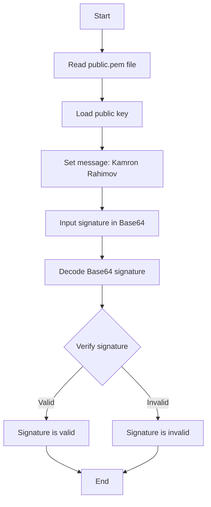

# Kiberxavfsizlik-topshiriq

```mermaid
flowchart TD
    A[Start] --> B[Read public.pem file]
    B --> C[Load public key]
    C --> D[Set message: Kamron Rahimov]
    D --> E[Input signature in Base64]
    E --> F[Decode Base64 signature]
    F --> G{Verify signature}
    G -->|Valid| H[Signature is valid]
    G -->|Invalid| I[Signature is invalid]
    H --> J[End]
    I --> J[End]

```
